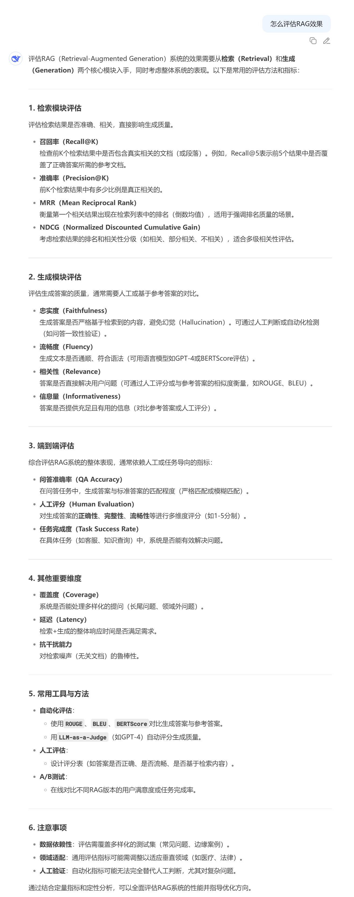
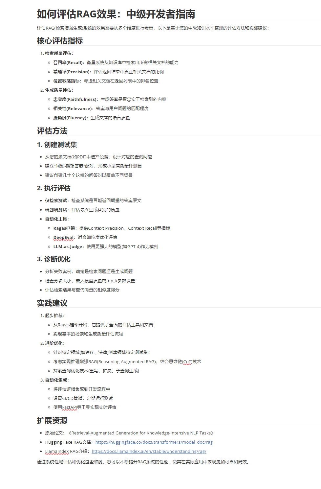

# 🚀 智能问答系统：基于用户画像的RAG实践

## 🌟 项目简介

本项目旨在构建一个**基于Python的简单RAG（检索增强生成）系统**，其核心创新在于引入**用户画像分析**
，使AI能够更好地理解用户的知识水平和需求，从而提供更精准、个性化的回答。

**💡 核心理念：让AI更懂你！**

**应用场景：** 针对个人知识库（如笔记），AI通过预先阅读并分析知识库内容，判断用户当前的掌握水平，进而调整回答策略，提供定制化的知识服务。
在doc/system design有详细的设计与日志。

在 `doc/system design` 目录下，提供了详细的系统设计文档与开发日志。

➡️➡️➡️[**深入了解系统设计**](doc/system%20design/个人知识库分析系统设计.md)⬅️⬅️⬅️

> 💡 **拓展阅读：**
> 如果您对Java生态的大模型对话感兴趣，可以参考我们的姊妹项目 [llm-for-java-developers](https://github.com/tataCrayon/llm-for-java-developers) (
> 基于LangChain4j框架的对话系统)。

## 🛠️ 技术栈概览

- **核心框架：**

  - **[FastAPI](https://fastapi.tiangolo.com/)**：高性能、易于使用的Python Web框架，用于构建RESTful API接口。

  - **[LangChain](https://www.langchain.com/)**：强大的LLM应用开发框架，简化RAG系统的构建流程。


- **向量数据库：**

  - **[Chroma](https://www.trychroma.com/)**：轻量级、嵌入式的向量数据库，用于高效存储和检索文档嵌入。


- **嵌入模型 (Embeddings)：**

  - **Qwen3-Embedding-4B**

  - **BGE-Large-ZH**

  - _（可根据需求灵活切换，以适应不同场景下的文本嵌入需求）_


- **大语言模型 (LLM)：**

  - **DeepSeek**：本项目主要演示中使用的强大语言模型，用于生成高质量的回答。

## 🚀 效果演示

我们使用 DeepSeek 的 `deepseek-chat` 模型进行对话演示。

**示例问题：** `怎么评估RAG效果`

可以看出，在引入用户画像分析后，回答变得更具针对性，粗略达成了预期的效果。


> 项目暂无前端页面，通过调用FastAPI接口进行问答。

### 1. 传统问答 (不带用户画像分析)

使用DeepSeek网页版，关闭联网搜索与深度思考。


### 2. 增强RAG问答 (带用户画像分析)

系统首先对用户的知识水平进行分析，然后根据分析结果进行回答。

- 用户画像分析结果示例

```txt

LLM分析结果 - 水平: intermediate, 置信度: 0.85

分析说明: 用户查询关于如何评估RAG效果，这是一个具体的技术问题，涉及实践应用和优化。
检索到的文档内容涵盖了评估流程、具体指标（如Context Precision、Context Recall）、
工具（如Ragas）以及优化策略，表明用户需要的是实践指导和具体实现方法，而非基础概念。

用户背景中的文档如《RAG深入了解P2：评估.md》和《RAG轻松通-P1：分块.md》也显示其对RAG有基础了解，
正在寻求更深入的应用和优化知识。因此，判断用户的知识水平为intermediate。
```



## ⚙️ 快速开始 (开发指南)

在项目根目录下创建 `.env` 文件，参考如下：

```txt
# llm key
DEEPSEEK_API_KEY="sk-xx"
SERPAPI_API_KEY="xx"

# task dir
KNOWLEDGE_BASE_DIR="G:\Note\职业发展\Java技术栈"

# log config
LOG_LEVEL=10

# chroma config
CHROMA_COLLECTION_NAME="knowledge_base"
CHROMA_PERSIST_DIR=F:/Projects/PythonProjects/llm-for-python-developers/data/vector_store

# huggingface config
HF_ENDPOINT="https://hf-mirror.com"

# embedding model config
MODEL_LOCAL_DIR=F:/ProgrammingEnvironment/AI/EmbeddingModel
QWEN_4B_DIR=F:/ProgrammingEnvironment/AI/EmbeddingModel/Qwen_Qwen3-Embedding-4B
BGE_LARGE_ZH_DIR=F:/ProgrammingEnvironment/AI/EmbeddingModel/BGE-Large-ZH
BGE_BASE_ZH_DIR=F:/ProgrammingEnvironment/AI/EmbeddingModel/BGE-Base-ZH
```

其他：略