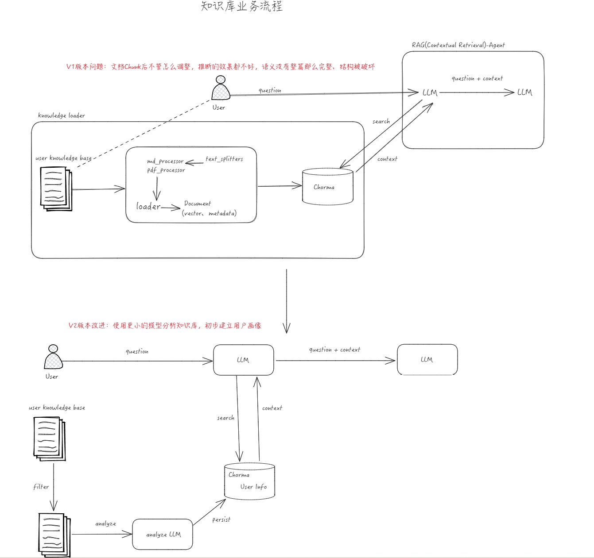

# 1 需求分析

需求概括：让AI更懂你。  
背景：用于有数据自己的个人知识库（笔记），AI需要先阅读知识库判断用户当前的掌握水平，从而更好地回答用户问题。

- 细化  
系统设计目标：使用AI，提供有深度的、全面的知识体系分析与笔记勘误、优化。
以用户个人知识库数据为基础，借助AI强大、全面的知识检索能力。提供复习、查漏补缺等能力。
- MVP  
知识水平推断。

## 1.1 核心需求

分析汇总。

- 需求行为抽象
需求需要进行用户知识库汇总：知识库加载。

## 1.2 边界考虑

- 系统规模
个人使用，也可以团队使用。
分两阶段设计，当前阶段支持1个人。
后续可以设计支持200人团队的快速分析、检索。

- 高性能
暂定缓存。

- 安全性
暂不考虑。

# 2 详细设计

## 2.1 LLM开发特征

### 2.1.1 文档特征

建设是结构化的知识库，树型结构。

- 内容丰富
中英文混合、有代码、有链接，要能识别处理，保证语义完整、结构完整。

- 关联性强
知识库，需要对文本数据进行聚类，做摘要、组织分类、关联性等。

- 多模态
需要能处理文本、视频、图片、音频，具备多模态处理能力。
当前阶段支持文本。

## 2.2 技术架构

- RAG系统类型
Contextual Retrieval，上下文检索，以提升关联性。

- 嵌入模型
需要使用中英文混合、有图片的知识库，免费。准确性和性能待评估。
暂定使用METB榜单上的`Qwen3-Embedding-4B`做文本处理。
	向量选择：
暂定单模态方案。

- 向量数据库
Chroma。需要个性化的元数据管理支持。
Faiss和Chroma2选1，选Chroma。

- 框架
FastAPI、LlamaIndex、LangChain。

- LLM
DeepSeek。DS，但使用OpenAIModel规范，可以兼容替换为其他模型。

# 3 演进日志  

当前采取的是“混合排序”策略。
对于个人知识库来说，相关性是一个复杂的概念，不能单靠向量的‘语义相似’这一个维度来衡量。

- 混合策略
  向量搜索+关键词匹配+元数据权重

- EmbeddingModel
最开始选的QW4B，我的4060laptop跑不动。
后改用bge-large-zh-v1.5。

- 分块
分块效果不好，优化块大小、分割方式。
最开始分块最大500，信息比较碎片化。且没有考虑到代码与表格存在，上下文丢失。

- 元数据
优化元数据设计，增加更多特征信息、基本筛选、聚类。
关键词最初使用yake。

TODO 引入预训练模型进行特征计算。

- **提示词**
增加元数据利用，优化提示词。
优化上下文内容，更多数据，更多的token使用。

TODO不仅仅是基于知识库的分析，提示词允许用户输入自己的背景、专业领域、学习目标。
TODO提示词补充在context不足时应该怎么做。

- 文档初次筛选
相似度检索，按照元数据特征信息进行分数排名，多候选——>精选。
K值最开始是5，筛选2xK的数据然后依据得分进行筛选，后面改成K值默认20,3xK。

TODO 相似度+BM25筛选。

## 3.1 下一步计划

- **PDFProcessor**：类似地为 PDFProcessor 添加 chunk_overlap 和混合检索支持。
- **多模态支持**
- **混合检索实现**：在检索时结合 Chroma 的向量检索和 BM25（例如使用 rank_bm25 库）。
- **性能优化**：分批处理大文件，或使用多线程加速。
